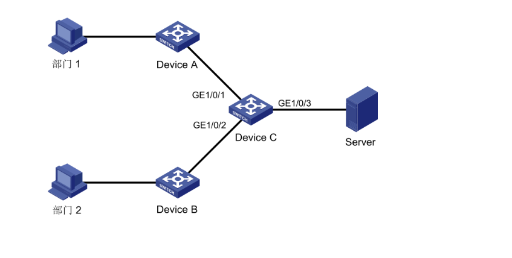

# 1.端口镜像配置

## 1 端口镜像配置

### 1.1 端口镜像简介

端口镜像是将指定端口（源端口）的报文复制一份到其它端口（目的端口），目的端口会与数据监

测设备相连，用户利用这些数据监测设备来分析复制到目的端口的报文，进行网络监控和故障排除。

#### 1.1.1 端口镜像的基本概念

为了更好地理解后面的内容，首先介绍一下端口镜像中涉及的基本概念。

1源端口

源端口是被监控的端口，用户可以对通过该端口的报文进行监控和分析。

2目的端口

目的端口也可称为监控端口，该端口将接收到的报文转发到数据监测设备，以便对报文进行监控和

分析。

3镜像的方向

●端口镜像的方向分为三种：

○入方向：仅对源端口接收的报文进行镜像。

○出方向：仅对源端口发送的报文进行镜像。

○双向：对源端口接收和发送的报文都进行镜像。

#### 1.1.2 端口镜像的分类

端口镜像分为两种：

●本地端口镜像：是指将设备的一个或多个源端口的报文复制到本设备的一个目的端口，用于 报文的监控和分析。其中，源端口和目的端口必须在同一台设备上。

●远程端口镜像：除了可以实现本地端口镜像的功能外，它还突破了源端口和目的端口必须在 同一台设备上的限制，使源端口和目的端口间可以跨越多个网络设备。目前，远程端口镜像 功能可以穿越二层网络，但无法穿越三层网络。

#### 1.1.3 端口镜像的实现方式

本地端口镜像可以对所有报文（包括协议报文和数据报文）进行镜像。

本地端口镜像通过本地镜像组的方式实现。源端口和目的端口在同一个本地镜像组中，设备将源端

口的报文复制一份并转发到目的端口。

<div align="center"></div>

​ 图 1-1

如 图 1-1所示，源端口的报文被镜像到目的端口，这样，接在目的端口上的数据监测设备就可以对

源端口的报文进行监控和分析。

### 1.2 端口镜像典型配置举例

#### 1.2.1 本地端口镜像配置举例

1组网需 用户网络描述如下：

○部门 1 的报文通过端口 GigabitEthernet1/0/1 接入 Device C。

○部门 2 的报文通过端口 GigabitEthernet1/0/2 接入 Device C。

○Server 接在 Device C 的 GigabitEthernet1/0/3 端口上

需求为：用户希望通过 Server 对部门 1 和部门 2 收发的报文进行监控。

使用本地端口镜像功能实现该需求：

○端口 GigabitEthernet1/0/1 和 GigabitEthernet1/0/2 为镜像源端口。

○连接 Server 的端口 GigabitEthernet1/0/3 为镜像目的端口。

2组网图

图1-2 配置本地端口镜像组网图



3配置步骤

3.1创建本地镜像组。

```
<DeviceC> system-view
DeviceC] mirroring-group 1 local
```

3.2为本地镜像组配置源端口和目的端口。

```
[DeviceC] mirroring-group 1 mirroring-port gigabitethernet 1/0/1 gigabitethernet 1/0/2 both
[DeviceC] mirroring-group 1 monitor-port gigabitethernet 1/0/3
```

3.3显示所有镜像组的配置信息。

```
[DeviceC] display mirroring-group all
mirroring-group 1:
type: local
status: active
mirroring port:
GigabitEthernet1/0/1 both
GigabitEthernet1/0/2 both
monitor port: GigabitEthernet1/0/3xxxxxxxxxx [DeviceC] display mirroring-group allmirroring-group 1:type: localstatus: activemirroring port:GigabitEthernet1/0/1 bothGigabitEthernet1/0/2 bothmonitor port: GigabitEthernet1/0/3[DeviceC] display mirroring-group allmirroring-group 1:
```

配置完成后，用户就可以在 Server 上监控部门 1 和部门 2 收发的所有报文。


引用：



